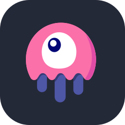

<!-- ============ HEADER ============ -->
<h1 align="center">Hi there! 👋 I'm Marlon</h1>

  

  &nbsp;&nbsp;
  &nbsp;&nbsp;
  

---

<!-- ============ ABOUT ME ============ -->
## 🧑‍💻 About me

I'm a **Software Developer specialized in Backend**, working at a software development company. My main stack is **PHP** with **Symfony** or **Laravel**, and I love building systems that are robust, scalable, and easy to maintain.

- 🔭 I'm currently building **APIs and web applications** for real clients
- 🧠 I focus on **clean architecture, best practices, and maintainable code**
- 🗄️ Solid experience modeling and optimizing **MySQL** and **PostgreSQL** databases
- 🎨 I also get around on the frontend with **React, TypeScript, and Tailwind**
- 🤖 Right now I'm teaching LLMs to talk to my PHP APIs (RAG, pgvector, MCP)... and to not hallucinate in production 😅
- 🤝 Open to collaborating on **open source** and backend projects
- ⚡ Fun fact: I enjoy debugging more than writing new code. Finding the reason something broke feels like solving a puzzle.

---

<!-- ============ TECH STACK ============ -->
## 🛠️ Tech stack & tools

Backend

  

Databases

  

Frontend

    

Tools & DevOps

  

---

  <i>"Good code is its own best documentation."</i> — Steve McConnell

  ⭐ Thanks for stopping by! ⭐

